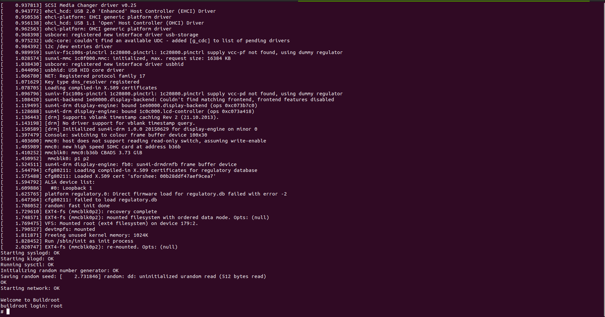
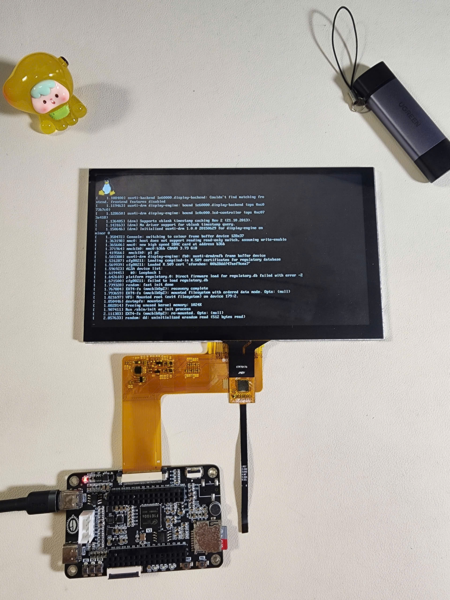

<h1>
Prebuilt file for F1C100S Processer from Allwinner
</h1>

<h2>
1. Create partition on memory card
</h2>

Suppose your computer recognizes the memory card as /dev/sdc

```bash
sudo fdisk /dev/sdc
# Exmaple: Create partition 1 with 100MB size
n -> p -> 1 -> 2048 -> 206847        
# Exmaple: Create partition 2 with 1GB size
n -> p -> 2 -> 206848 -> 2304999
# Save and exit
w
# Formats the /dev/sdc1 partition in FAT32 format.
sudo mkfs.vfat /dev/sdc1
# Formats the /dev/sdc2 partition in EXT4 format.
sudo mkfs.ext4 /dev/sdc2
```

<h2>
2. Upload UBoot
</h2>

```bash
sudo dd if=u-boot-sunxi-with-spl.bin of=/dev/sdc bs=1024 seek=8
```

<h2>
3. Upload Kernel and device tree
</h2>

```bash
sudo umount /dev/sdc1   # If needed
sudo mount /dev/sdc1 /mnt
sudo cp zImage /mnt/
sudo cp suniv-f1c100s-licheepi-nano.dtb /mnt/
sync
sudo umount /dev/sdc1
```

<h2>
4. Upload rootfile system
</h2>

```bash
sudo umount /dev/sdc2   # If needed
sudo mount /dev/sdc2 /mnt
sudo tar -xf rootfs.tar -C /mnt/
sync
sudo umount /dev/sdc2
```

<h2>
5. Insert SD card to your F1c100s board and check the result
</h2>



---
---
<h1>
Prebuilt file for LCD Test (Tested with LCD 1024x600 pixel)
</h1>

You can use the image file on folder 2-Enable-LCD for test the LCD (Tested with 7 inchs 1024*600 LCD)

